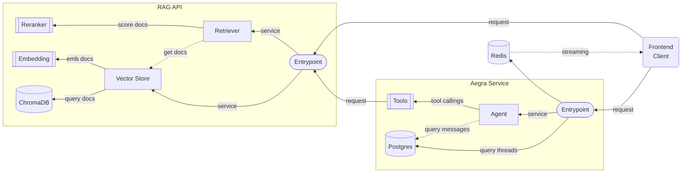

# RAG Agent
A multimodal RAG agent build on LangChain technologies and local, self-host models.

Agent built as part of my Bachelor's thesis for [Data Science degree](https://www.enesmorelia.unam.mx/licenciaturas/tecnologias-para-la-informacion-en-ciencias/) in [ENES Unidad Morelia](https://www.enesmorelia.unam.mx/).

## Architecture


## Installation
```bash
pip install uv
uv pip install -r requirements.txt
```

## Usage 
```bash
cp .env.example .env
```
set `HF_TOKEN`

```bash
docker compose up
```

## Testing
Each folder contains unit tests of each service and component
```bash
pytest tests
```