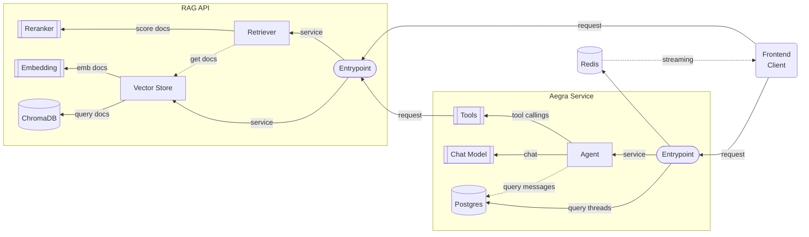

# RAG Agent
An initial solution to develop a multimodal RAG agent build on LangChain ecosystem using local, no closed models. This system provides an API for the RAG and agent compatible with the LangGraph SDK.

## Architecture

* Both embedding and reranker models are served with vLLM running on GPU, and chat model is served with llama-cpp running on CPU. 
* Both RAG and agent are developed with Python LangChain.
* Aegra provides an agent serving compatible with the LangGraph SDK (agent protocol).
* Open to add new tools to expand the agent harness.

## Installation &  Usage
### Local Development Stage
```bash
pip install uv
uv pip install -r requirements.txt
```

### Testing and Deployment Stage
```bash
cp .env.example .env
```
set `HF_TOKEN`

```bash
docker compose up
```

## Run Tests
```bash
pytest tests
```

## Author, Affiliation and Contact
Alexis Aguilar [Student of Bachelor's Degree in "Tecnologías para la Información en Ciencias" at Universidad Nacional Autónoma de México [UNAM](https://www.unam.mx/)]: alexis.uaguilaru@gmail.com

Project developed as component for my Bachelor's thesis: "Desarrollo de un Agente de Inteligencia Artificial para Optimizar el Trámite de Titulación para los Estudiantes de la ENES Unidad Morelia"