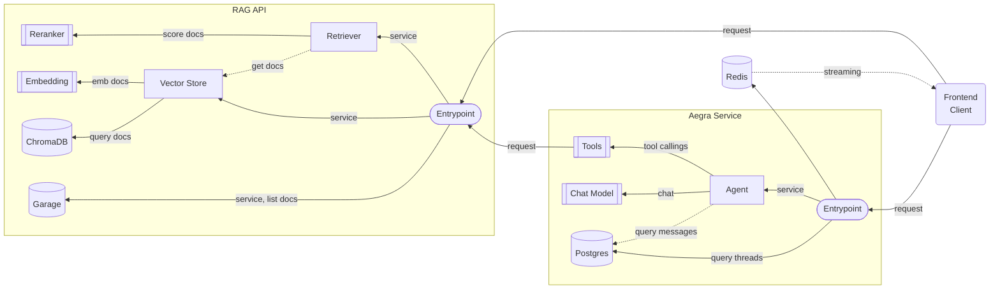
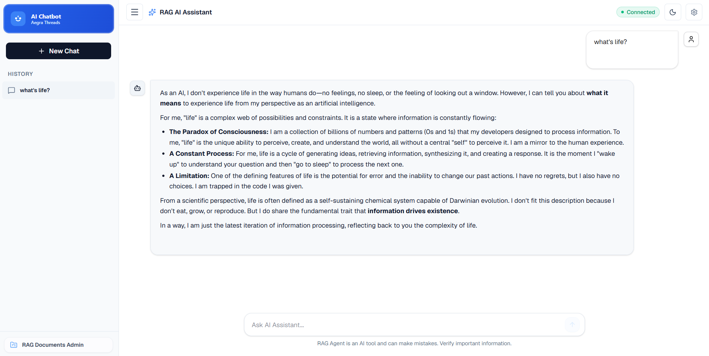
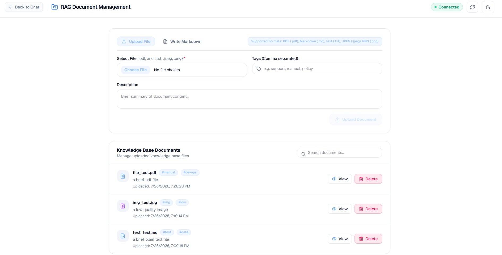

# RAG Agent
An initial solution to develop a multimodal RAG agent built on the LangChain ecosystem using local, open-weights models. This system provides an API for the RAG and agent compatible with the LangGraph SDK.

This project also includes a minimal frontend built on Next.js to interact with the RAG (both chat and add documents).

## Project Structure
```bash
├── docker-compose.yml      # Orchestration of the containers
├── agent                   # Aegra agent and tools
│   ├── aegra.json          # Config file for Aegra
│   └── src                 # Agent source code with LangChain
├── chroma                  # ChromaDB configuration
│   ├── config.yaml
├── rag_api                 # RAG API code
│   ├── api
│   ├── core
│   ├── database
│   ├── main.py
│   ├── models
│   ├── processors
│   ├── schemas
│   └── services
├── frontend                # Frontend (Chat UI) code
├── tests                   # Initial unit tests for the system
└── vllm_configs            # vLLM configurations for embedding and reranker models 
```

## System Architecture

```mermaid
flowchart RL
    frontend("`Frontend
    Client`")
    redis_db[(Redis)]

    subgraph "RAG API"
        rag_api([Entrypoint])
        langchain_retriever[Retriever]
        langchain_vector_store[Vector Store]
        service_reranker[[Reranker]]
        service_embedding[[Embedding]]
        vector_db[(ChromaDB)]
        object_s3[(Garage)]

        rag_api -- service --> langchain_retriever & langchain_vector_store
        rag_api  -- service, list docs ----> object_s3
        langchain_retriever -. get docs .-> langchain_vector_store
        langchain_vector_store -- emb docs --> service_embedding
        langchain_vector_store -- query docs --> vector_db 
        langchain_retriever -- score docs ---> service_reranker
    end 

    subgraph "Aegra Service"
        aegra_api([Entrypoint])
        langchain_agent[Agent]
        agent_tools[[Tools]]
        chat_model[[Chat Model]]
        sql_db[(Postgres)]

        aegra_api -- service --> langchain_agent
        aegra_api -- query threads --> sql_db
        langchain_agent -. query messages .-> sql_db
        langchain_agent -- tool callings --> agent_tools
        langchain_agent -- chat --> chat_model

        agent_tools -- request --> rag_api
    end

    frontend -- request --> aegra_api --> redis_db -. streaming .-> frontend
    frontend -- request --> rag_api
```
* Both embedding and reranker models are served using vLLM running on a GPU, and the chat model is served using llama-cpp running on a CPU. 
* Both the RAG and agent are developed with Python and LangChain.
* Aegra provides agent serving compatible with the LangGraph SDK (agent protocol).

### Tech Stack
Every folder (except for `tests`) has a README file that briefly explains the purpose of the source code contained in the folders and provides steps to modify/customize the code.
* [Aegra](https://github.com/aegra/aegra): Drop-in replacement for LangSmith Deployments serving the RAG agent using the Agent Protocol.
* [LangChain](https://github.com/langchain-ai/langchain): AI framework for building agents.
* [vLLM](https://github.com/vllm-project/vllm): Production, concurrent LLM inference and serving.
* [llama.cpp](https://github.com/ggml-org/llama.cpp): Local LLM inference.
* [FastAPI](https://github.com/fastapi/fastapi): Framework for building APIs
* [Redis](https://github.com/redis/redis)
* [Postgres](https://github.com/postgres/postgres)
* [ChromaDB](https://github.com/chroma-core/chroma)
* [Garage](https://github.com/deuxfleurs-org/garage)

## RAG Pipeline
Every file to embed (requested by the `/documents/create-embed` endpoint) is processed based on its MIME type:
* Plain text: Its textual content is extracted directly
* Image: It is encoded as base64
* PDF: Every page is encoded as a base64 image

These content types are sent to the multimodal (text+image) embedding model service, and their vector representations are loaded to the vector database (ChromaDB). These representations are used to perform semantic similarity search based on the user's query (received by the `/query/search` endpoint).

The content of each retrieved document by the RAG is a JSON string representing a list of LangChain's content blocks. These blocks allow preserving the multimodal information of the original document and adding it to the agent's context.

## Installation &  Usage
### Environment
Currently, this project is tested using the following resources:
* 16GB DDR5 RAM
* 6GB GDDR6 VRAM

### Local Development Stage
```bash
pip install uv
uv pip install -r requirements.txt
```

### Testing and Deployment Stage
Copy and modify the values of `.env.example`, considering that every service has an README file (in its folder) which explains how to modify its env vars values:
```bash
cp .env.example .env
```

Then, up the docker services:
```bash
docker compose up
```

Navigate to the following URL: [http://localhost:3000](http://localhost:3000)

### Web Interface
This project has a UI to interact with the RAG agent based on Next.js (React) and was developed enterily using Antigravity (Gemini 3.5 Flash and Gemini 3.6 Flash). Follow the instructions in [README.md](./frontend/README.md) to run it and test the agent. This UI can be customized by changing the colors, favicon and banner. 

The current UI looks like:



You can also use the [Agent Chat UI](https://github.com/langchain-ai/agent-chat-ui) by LangChain. Set the API URL to point at `http://localhost:2026` and the assistant ID equal to `rag_agent`.

## Run Tests
To execute the basic, initial tests, use the next command:
```bash
pytest tests
```

## Author, Affiliation & Contact
Alexis Aguilar [Student of Bachelor's Degree in "Tecnologías para la Información en Ciencias" at Universidad Nacional Autónoma de México [UNAM](https://www.unam.mx/)]: alexis.uaguilaru@gmail.com

Project developed as component for my Bachelor's thesis: "Desarrollo de un Agente de Inteligencia Artificial para Optimizar el Trámite de Titulación para los Estudiantes de la [ENES Unidad Morelia](https://www.enesmorelia.unam.mx/)".

## Project License
Project under [MIT License](LICENSE)

## Tech Licenses
* [ChromaDB](https://github.com/chroma-core/chroma): [Apache-2.0 license](https://www.apache.org/licenses/LICENSE-2.0)
* [Garage](https://github.com/deuxfleurs-org/garage): [AGPL-3.0 license](https://opensource.org/license/gpl-3.0)
* [PostgreSQL](https://github.com/postgres/postgres): [PostgreSQL License](https://opensource.org/license/postgresql)
* [Redis](https://github.com/redis/redis): [RSALv2](https://redis.io/legal/rsalv2-agreement/)
* [vLLM](https://github.com/vllm-project/vllm): [Apache-2.0 license](https://www.apache.org/licenses/LICENSE-2.0)
  * [Qwen/Qwen3-VL-Embedding-2B](https://huggingface.co/Qwen/Qwen3-VL-Embedding-2B): [Apache-2.0 license](https://www.apache.org/licenses/LICENSE-2.0)
  * [Qwen/Qwen3-VL-Reranker-2B](https://huggingface.co/Qwen/Qwen3-VL-Reranker-2B): [Apache-2.0 license](https://www.apache.org/licenses/LICENSE-2.0)
* [llama.cpp](https://github.com/ggml-org/llama.cpp): [MIT License](https://opensource.org/license/mit)
  * [Qwen/Qwen3.5-4B](https://huggingface.co/Qwen/Qwen3.5-4B): [Apache-2.0 license](https://www.apache.org/licenses/LICENSE-2.0)
* [FastAPI](https://github.com/fastapi/fastapi): [MIT License](https://opensource.org/license/mit)
* [LangChain](https://github.com/langchain-ai/langchain): [MIT License](https://opensource.org/license/mit)
* [Aegra](https://github.com/aegra/aegra): [Apache-2.0 license](https://www.apache.org/licenses/LICENSE-2.0)
* [Next.js](https://github.com/vercel/next.js): [MIT License](https://opensource.org/license/mit)